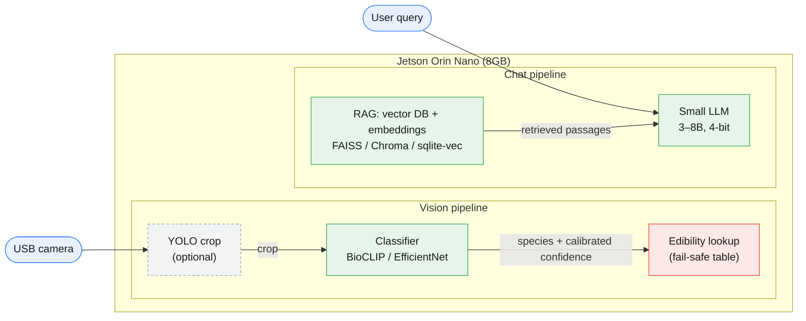

# Pocket Crockett — Project Overview

*A pocket-sized, offline frontier assistant: survival knowledge + plant/tree ID, running on the edge.*

A one-page quick reference. For the detailed data-sourcing plan, see the companion **Data Gathering Guide**.

---

## What it is

An offline AI assistant running on an **Nvidia Jetson Orin Nano**, with two capabilities:

1. **Chat** — ask survival, farming, food-preservation, and first-aid questions; get grounded, practical, risk-aware answers from a curated knowledge base.
2. **Vision** — point a USB camera at a plant or tree, identify the species, and look up whether it's edible, useful, or dangerous.

Design ethos: **offline-first, fail-safe, cite-your-sources.** It's a tool people might act on with no backup, so "I'm not sure" is a valid and important answer.

---

## Architecture at a glance



---

## Key decisions (and the reasoning)

| Decision | Choice | Why |
|---|---|---|
| **How the LLM "knows" survival info** | **RAG, not fine-tuned facts** | Fine-tuning bakes facts into weights → confident hallucination. RAG answers *from source text* and can cite it. Critical when users act on the answer. |
| **Role of fine-tuning** | Persona/style only (small) | Teach the model *how* to answer (calm, practical, risk-aware), not *what* the facts are. |
| **On-device LLM size** | 3–8B params, 4-bit quantized | 8GB shared memory is the constraint. 3B is comfy; 7–8B Q4 fits but is tight alongside vision. |
| **On-device LLM runtime** | llama.cpp / Ollama (easy) or TensorRT-LLM / MLC (fast) | GGUF + Ollama to start; squeeze speed later if needed. |
| **Vision model** | Fine-tuned **BioCLIP** or EfficientNet/ConvNeXt — **not YOLO as the identifier** | Species ID is fine-grained *classification*, not object detection. YOLO's strength is boxes. Optional: YOLO as a first-stage cropper only. |
| **Confidence handling** | Calibrated scores + top-N over threshold | Raw softmax is overconfident. Temperature-scale it so "0.8" means ~80% right, then gate the edibility verdict on it. |
| **Edibility data** | Hand-assembled, fail-safe table | No clean open "is it edible" DB exists. Default everything to `unknown`/`do_not_eat`; flag deadly look-alikes loudly. |

---

## The two build pipelines

**Pipeline A — Knowledge (chat)**
Gather public-domain/openly-licensed survival texts → clean & OCR → chunk + metadata → vector DB for RAG. Separately, synthesize a small instruction set for light persona fine-tuning.

**Pipeline B — Vision (plant/tree ID)**
Gather labeled North American plant imagery → fine-tune a bio-pretrained classifier → calibrate confidence → export to TensorRT for the Jetson. Separately, build the species→edibility lookup table.

*(Full source lists, licensing notes, and formatting specs live in the Data Gathering Guide.)*

---

## Hardware & tooling split

| Phase | Where | Tools |
|---|---|---|
| **Training (LLM)** | Rented CUDA GPU (RunPod) or Colab | **Unsloth** (start here) → Axolotl/LLaMA-Factory later. QLoRA technique. |
| **Training (vision)** | Rented CUDA GPU (real compute) | PyTorch + a bio-pretrained backbone; this is where rental hours actually add up. |
| **Dev / data prep / RAG** | MacBook (unified memory) | Local LLM via Ollama or MLX; build & test RAG pipeline here. |
| **Deployment** | Jetson Orin Nano | Quantized LLM + TensorRT classifier + local vector DB. |

> ⚠️ The MacBook can't run the mainstream CUDA fine-tuning stack (Unsloth/bitsandbytes are CUDA-only). It's the dev/prep/inference machine; **rent CUDA for training.** First training loop is free on Colab.

---

## Safety principles (non-negotiable for an edibility tool)

- **Fail safe.** Uncertain ⇒ "do not eat." Never guess on the dangerous side.
- **Show top-N candidates,** not one confident answer.
- **Two separate confidences** must both clear: model's confidence it's *this species*, and our confidence the species is *safe*.
- **Surface deadly look-alikes loudly** — water hemlock, poison hemlock, death camas, deadly *Amanita* — regardless of score.
- **Cite sources** in chat answers; tag low-trust (old herbal) vs. high-trust (modern gov/medical) material.

## Local setup

The Python tooling in `scripts/` and `tools/` runs in a project-local virtualenv so heavy ML deps (boto3 now; torch / transformers / chromadb later) don't pile into your global Python and start version-fighting each other.

```bash
# One time, from the repo root.
python3 -m venv .venv
.venv/bin/python -m pip install --upgrade pip
.venv/bin/python -m pip install -r requirements.txt

# Each shell where you'll run the scripts.
source .venv/bin/activate
```

Once activated, plain `python3 tools/upload_to_r2.py` etc. picks up the right interpreter. `deactivate` to exit the venv. The `.venv/` directory is gitignored.

Credentials (`R2_*`) come from either your shell or a gitignored `.env` file at the repo root — see `.env.example` for the template.

---

## Data storage and licensing

The vision image bytes are not committed to git. They are packaged as tar shards under `vision/shards/` and tracked by committed manifests plus `vision/checksums.sha256`; see `vision/data_storage.md`.

The current vision dataset is for a personal, non-commercial project and includes CC-BY-SA, CC-BY-NC, and CC-BY-NC-SA-family images. Keep any image bucket private. If project intent changes to commercial or public redistribution, revisit NC image retention and share-alike obligations before releasing data, derived dataset artifacts, or model weights.

---

## Suggested build order

1. **De-risk the plumbing.** Free Colab + Unsloth: one full LLM fine-tune loop end to end on a tiny dataset.
2. **Stand up RAG** on the Mac with a handful of cleaned texts; prove grounded, cited answers.
3. **Vision loop** with PlantNet-300K: train → calibrate → export → run on Jetson.
4. **Build the fail-safe edibility table** (schema first, with safe defaults, then populate).
5. **Integrate on the Jetson:** camera → classifier → edibility lookup, and query → RAG → LLM.
6. **Scale data** in both pipelines once each loop works.

---

*Pocket Crockett — keep the frontier in your pocket.*
